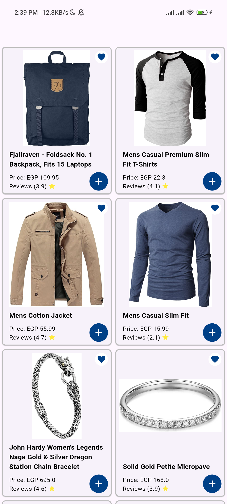
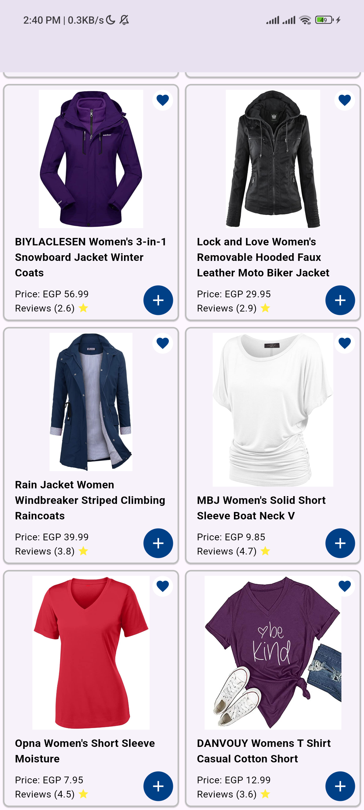

# My Flutter Project

## Description

This project is a Flutter application that displays a list of products using the Store API.

## Screenshots




## How to Run

1. Clone the repository:
   ```bash
   https://github.com/PeshoOReda/elevated_flutter.git
